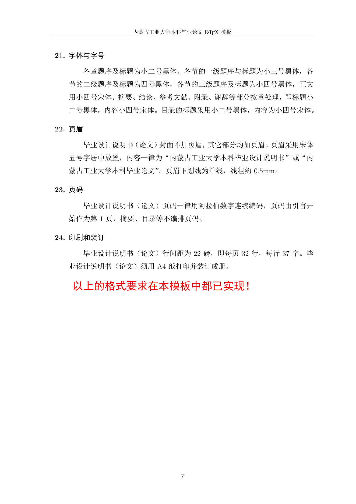

# SuKingYan
内蒙古工业大学/IMUT Latex模板 非官方！！

# 内蒙古工业大学本科毕业论文 LaTeX 模板说明

## 目录

- 引言
- 第一章 模板介绍
  - 1.1 文件说明
  - 1.2 已加载的宏包
- 第二章 正文要求
- 第三章 使用说明
  - 3.1 编译方式
  - 3.2 插图
    - 3.2.1 插图测试
  - 3.3 数学公式
    - 3.3.1 行内公式
    - 3.3.2 行间公式
    - 3.3.3 公式测试
  - 3.4 表格
    - 3.4.1 长表格测试
  - 3.5 化学方程式
    - 3.5.1 化学方程式测试
  - 3.6 参考文献
- 参考文献
- 附录 A 附录测试
- 附录 B 冒泡排序算法
- 致谢

## 插图

- 图 3-1 IMUTlogo
- 图 A1 长标题测试。这是个很长很长很长很长很长很长很长很长很长很长很长很长的标题

## 表格

- 表 1-1 宏包目录
- 表 3-1 长表格测试
- 表 A1 跑马灯 I/O 分配表
- 表 B1 跑马灯 I/O 分配表

# 引言

此模板的出现是因为作者大三期间用 LATEX 写了许多实验报告、设计说明书等，格式要求与《内蒙古工业大学本科生毕业设计说明书（论文）撰写规范（修订）》基本相同，故在家编写了一个模板，以方便后续使用。

模板在 TEXLive 编译系统下编写且可正常运行。由于作者水平有限，一些命令或者环境的使用不是很熟练，而且作者已经毕业，模板在使用过程中可能会遇到问题，烦请自行解决。

# 第一章 模板介绍

## 1.1 文件说明

解压后会得到 Cover、Body 和 Paper 三个文件夹。其中 Cover 文件夹为论文封面，Body 文件夹为论文内容。

Cover 和 Body 文件夹中还有一个 `figures` 文件夹，文档中插入的图片放在这里，这样可以让文件夹看起来更加整洁。

下面介绍各个文件夹中各文档类型。

1. **Cover 文件夹**
   - `Cover.tex`：为论文封面信息。在这里修改封面名字、班级等信息。
   - `Cover.pdf`：生成的封面 PDF 文件。
2. **Body 文件夹**
   - `Body.tex`：为论文封面信息。在这里编辑论文。
   - `Body.pdf`：生成的正文 PDF 文件。
   - `IMUTthesis.cls`：文档类定义文件，论文最核心的格式通过它来定义。
3. **Paper 文件夹**

   将前面两个文件夹各自生成的 PDF 文件组合；当然也可以用 PDF 编辑器实现这个功能。

   - `Paper.tex`：编译该文件即可得到论文。
   - `Paper.pdf`：最终论文。
4. **文件中的其他类型文档**
   - 文档中其他文件为辅助文件，每次编译都会生成。

## 1.2 已加载的宏包

**表 1-1 宏包目录**

|  |  |  |  |  |  |
| --- | --- | --- | --- | --- | --- |
| geometry | xcolor | subfigure | graphicx | float | amsmath |
| amsfonts | amssymb | bm | fancyhdr | abstract | amsmath |
| tocloft | hyperref | titletoc | listings | appendix | titlesec |
| longtable | caption | booktabs | tabularx | mhchem | ctex |

如果需要更改一些宏包设置，可以去 Body 文件夹下的 `IMUTthesis.cls` 文档修改，大部分情况无需修改。需要用到新的宏包，直接在导言区用 `\usepackage{}` 命令加载即可。

# 第二章 正文要求

## 1. 毕业设计说明书（论文）的各组成部分和排列顺序

封面、摘要、英文摘要、目录、图表清单及符号说明、引言（绪论）、正文、结论、注释、参考文献、附录、谢辞、外文文献及译稿。

## 2. 封面

采用内蒙古工业大学毕业设计说明书（论文）统一封面。

## 3. 毕业设计说明书（论文）题目

毕业设计说明书（论文）题目应能够概括整个论文的核心内容，字数不宜过多，一般不超过 25 字，尽量不设副标题。

## 4. 学科、专业名称

学科、专业名称按照《普通高等学校本科专业目录》（2012 年颁布）的名称填写，而非某一专业方向。

## 5. 时间

在封面下部写明毕业设计说明书（论文）提交时间。

## 6. 摘要及关键词

摘要是毕业设计说明书（论文）内容的简短陈述，一般在 300～500 字，应具有独立性和自含性（即不阅读全文就能获得必要信息）。需要说明研究目的、研究方法、结果或结论，重点是结果或结论。摘要中一般不使用图、表、公式，不引用参考文献。

关键词是供检索用的主题词条，一般 3～5 个，应采用能覆盖论文主要内容的通用技术词条，按词条外延层次从大到小排列，以分号相隔。

## 7. 英文摘要

中文摘要后为英文摘要，要求同中文摘要。

## 8. 目录

毕业设计说明书（论文）目录应包括全部章节的标题（要求编到 3 级标题）和参考文献、附录（可选择）、谢辞，页码右对齐。

## 9. 图表清单及符号说明

如毕业设计说明书（论文）中插图或表格较多，可分别列出清单置于目录之后。图表清单应有序号、图题（表题）和所在页码。毕业设计说明书（论文）中用到的符号，应加以说明。对于物理量应注明量纲。

## 10. 引言（或绪论）

毕业设计说明书（论文）引言（或绪论）应简要说明研究工作的目的范围、相关领域的研究进展、存在问题和研究工作的意义等。

## 11. 毕业设计说明书（论文）正文

正文是毕业设计说明书（论文）的核心。正文内容要逻辑清晰，层次分明，实事求是，简练可读。理工类、艺术类专业毕业设计说明书正文字数一般不低于 6000 字（含计算书的不低于 20000 字）；理工类、艺术类专业毕业论文正文字数一般不低于 12000 字；经济类、管理类专业毕业论文一般不低于 10000 字；法学类专业毕业论文一般不低于 6000 字；外语类专业毕业论文字数一般不低于 6000 单词。

因毕业设计（论文）工作涉及的学科选题、研究方法、工作进程、结果表达等有较大差异，对正文内容不作统一规定，但要明确指出该设计说明书（论文）的创新点和实际应用之处。文中引用他人成果部分，须单独书写并注明出处，不得将其与本人提出的理论分析混淆在一起。

## 12. 公式

毕业设计说明书（论文）正文中的公式应居中书写；如公式前有文字，空两格写文字，公式居中写，公式末尾不加标点。公式序号用阿拉伯数字分章依序连续编排，并加圆括号，如第一章第一个公式号为（1-1），附录 A 中的第一个公式为（A1）等。

## 13. 图表

插图包括曲线图、流程图、工艺图、设备图、框图、示意图和图片等。插图序号用阿拉伯数字分章依序连续编排，每一插图都应有简短确切的题名，连同图序置于图下，图序与图名之间空一格，图名不允许使用标点符号。

表格序号采用阿拉伯数字分章依序连续编排。每一表格都应有简短确切的题名，表序与表名书写于表的正上方，表序与表名之间空一格，表名不允许使用标点符号。

## 14. 结论

毕业设计说明书（论文）结论是对整个研究工作的归纳和综合总结。在结论中应明确指出本研究内容的创造性结果和理论，所得结果与已有结果的比较和本课题尚存在的问题，以及进一步开展研究的展望和设想。结论应该准确完整，明确精炼。

## 15. 注释

毕业设计说明书（论文）中有个别名词（情况）需要解释时，可加注说明。注释一律采用篇末注（将全部注释集中在文章末尾）。

## 16. 参考文献

所列参考文献应为毕业设计（论文）中引用文献。参考文献著录及标引参照国家标准《文后参考文献著录规则》（GB/T 7714-2005）的要求。

## 17. 附录

附录是毕业设计说明书（论文）主体部分的补充项目，视需要决定是否使用。需收录于毕业设计说明书（论文）中，但又不便书写于正文中的附加数据、资料、详细公式推导、特殊检测方法、程序等有特色的内容可作为附录。附录的篇幅不宜过长，一般不可超过正文。每一附录应另页起。

## 18. 谢辞

谢辞内容应简洁明了，实事求是。

## 19. 外文文献及译稿

毕业设计（论文）任务书中要求学生阅读的外文文献（用 A4 纸复印）和翻译成中文的稿件（以 A4 纸打印）一起装订，放入《内蒙古工业大学毕业设计（论文）袋》内。

外文文献及译稿合订本与毕业设计说明书（论文）分别装订。

## 20. 纸张及页面

原则上用 Word 97 以上版本打印输出。毕业设计说明书（论文）纸张用 A4 标准白纸（210 mm × 297 mm）。版心尺寸为：左边距 30 mm，右边距 25 mm，上边距 30 mm，下边距 25 mm。

## 21. 字体与字号

各章题序及标题为小二号黑体。各节的一级题序与标题为小三号黑体，各节的二级题序及标题为四号黑体，各节的三级题序及标题为小四号黑体，正文用小四号宋体。摘要、结论、参考文献、附录、谢辞等部分按章处理，即标题小二号黑体，内容小四号宋体。目录的标题采用小二号黑体，内容为小四号宋体。

## 22. 页眉

毕业设计说明书（论文）封面不加页眉，其它部分均加页眉。页眉采用宋体五号字居中放置，内容一律为“内蒙古工业大学本科毕业设计说明书”或“内蒙古工业大学本科毕业论文”。页眉下划线为单线，线粗约 0.5 mm。

## 23. 页码

毕业设计说明书（论文）页码一律用阿拉伯数字连续编码，页码由引言开始作为第 1 页，摘要、目录等不编排页码。

## 24. 印刷和装订

毕业设计说明书（论文）行间距为 22 磅，即每页 32 行，每行 37 字。毕业设计说明书（论文）须用 A4 纸打印并装订成册。

以上的格式要求在本模板中都已实现！

# 第三章 使用说明

## 3.1 编译方式

需用 XeLaTeX 编译，且使用者需要有一定的 LATEX 使用经验，需要会使用常用宏包的一些功能，例如数学公式、图片等。

## 3.2 插图

将需要插入的图片放入 `figures` 文件夹下。

### 3.2.1 插图测试



*图 3-1 IMUTlogo（原页截图，含 logo1、logo2、logo3、logo4）*

## 3.3 数学公式

### 3.3.1 行内公式

行内公式通过代码 `$ ... $` 实现。为了美观，建议文中所有数学形式都加行间数学模式。

### 3.3.2 行间公式

行间公式可通过代码 `\[ ... \]` 实现。

### 3.3.3 公式测试

这是行内数学公式：

$$
\int \frac{1}{\sqrt{1-x^2}}\,dx = \arcsin x + C
$$

这是行间数学公式：

$$
d\vec{B} = \frac{\mu_0 I\,d\vec{l} \times \vec{r}}{4\pi r^3} = \frac{\mu_0 I\,dl\sin\theta}{4\pi r^2} qquad (3-1)
$$

## 3.4 表格

### 3.4.1 长表格测试

这是一个长表格，如表 3-1。

**表 3-1 长表格测试**

| 符号 | 表示含义 | 单位 |
| --- | --- | --- |
| $t$ | 时间 | s |
| $C_{1-5}$ | 第 1 - 5 温区温度 | °C |
| $C_6$ | 第 6 温区温度 | °C |
| $C_7$ | 第 7 温区温度 | °C |
| $C_{8-9}$ | 第 8 - 9 温区温度 | °C |
| $C_{10-11}$ | 第 10 - 11 温区温度 | °C |
| $T$ | 温度 | °C |
| $T_{max}$ | 最大温度 | °C |
| $v$ | 传送带速度 | cm/min |
| $v_{max}$ | 最大传送带速度 | cm/min |
| $x$ | 温区长度 | cm |
| $k_{1-5}$ | 第 1 - 5 温区的 k 值 | 常数 |
| $k_6$ | 第 6 温区的 k 值 | 常数 |
| $k_7$ | 第 7 温区的 k 值 | 常数 |
| $k_{8-9}$ | 第 8 - 9 温区的 k 值 | 常数 |
| $k_{10-11}$ | 第 10 - 11 温区的 k 值 | 常数 |

## 3.5 化学方程式

考虑到一些同学需要写化学公式，本模板加载了相关宏包 `mhchem`。

### 3.5.1 化学方程式测试

$$
\ce{Zn^2+ + 2OH^- <=> Zn(OH)2 v <=> [Zn(OH)4]^2-}
$$

其中，`\ce{Zn^2+ + 2OH^- <=> Zn(OH)2 v}` 表示沉淀，`\ce{Zn(OH)2 + 2OH^- <=> [Zn(OH)4]^2-}` 表示离子。

## 3.6 参考文献

插入参考文献可以去中国知网、百度学术、Google Scholar 等文献库引用复制，然后将其粘贴于参考文献处。

模板下载地址：`https://wws.lanzous.com/b01i01jfa`，提取码：`da88`。

# 参考文献

1. 刘海洋. *LATEX 入门* [J]. 电子工业出版社, 北京, 2013.
2. `lshort-zh-cn.pdf`
3. 
4. 

# 附录 A 附录测试

## A.1 论文无需附录去掉该部分

## A.2 一些测试

$$
\begin{bmatrix} z_1 \\ z_2 \\ \vdots \\ z_n \end{bmatrix}
=
\begin{bmatrix}
1 & x_1 & x_1^2 \\n+1 & x_2 & x_2^2 \\n+\vdots & \vdots & \vdots \\n+1 & x_n & x_n^2
\end{bmatrix}
\begin{bmatrix} a_1 \\ a_2 \\ a_3 \end{bmatrix}
\qquad (A1)
$$

$$
y_n = y_{max} \times e^{-\frac{(x_n-x_{max})^2}{Q}} qquad (A2)
$$


*图 A1 长标题测试。这是个很长很长很长很长很长很长很长很长很长很长很长很长的标题。*

**表 A1 跑马灯 I/O 分配表**

| 输入 | 地址 | 输出 | 地址 |
| --- | --- | --- | --- |
| SB0 | I0.0 | D1 灯 | Q0.0 |
| SB1 | I0.1 | D2 灯 | Q0.1 |
|  |  | D3 灯 | Q0.2 |
|  |  | D4 灯 | Q0.3 |
|  |  | D5 灯 | Q0.4 |

# 附录 B 冒泡排序算法

```java
public static void bubble_sort(int[] arr) {
    int i, j, temp, len = arr.length;
    for (i = 0; i < len - 1; i++)
        for (j = 0; j < len - 1 - i; j++)
            if (arr[j] > arr[j + 1]) {
                temp = arr[j];
                arr[j] = arr[j + 1];
                arr[j + 1] = temp;
            }
}
```

**表 B1 跑马灯 I/O 分配表**

| 输入 | 地址 | 输出 | 地址 |
| --- | --- | --- | --- |
| SB0 | I0.0 | D1 灯 | Q0.0 |
| SB1 | I0.1 | D2 灯 | Q0.1 |
|  |  | D3 灯 | Q0.2 |
|  |  | D4 灯 | Q0.3 |
|  |  | D5 灯 | Q0.4 |

$$
\begin{bmatrix} z_1 \\ z_2 \\ \vdots \\ z_n \end{bmatrix}
=
\begin{bmatrix}
1 & x_1 & x_1^2 \\n+1 & x_2 & x_2^2 \\n+\vdots & \vdots & \vdots \\n+1 & x_n & x_n^2
\end{bmatrix}
\begin{bmatrix} a_1 \\ a_2 \\ a_3 \end{bmatrix}
\qquad (B1)
$$

$$
f(x) = \int_{-\infty}^{\infty} \hat{f}(x)\xi e^{2\pi i\xi x} \, d\xi qquad (B2)
$$

# 致谢

